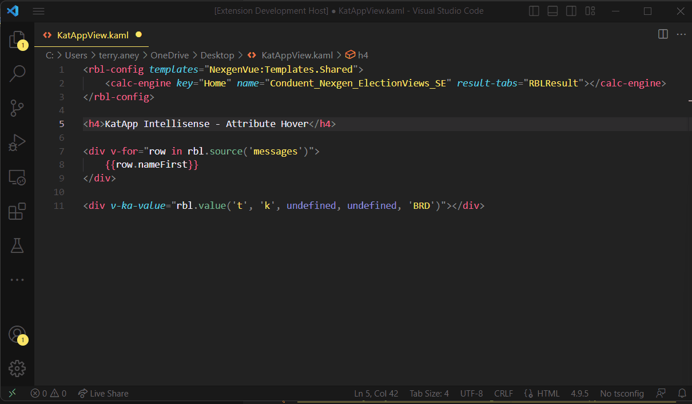
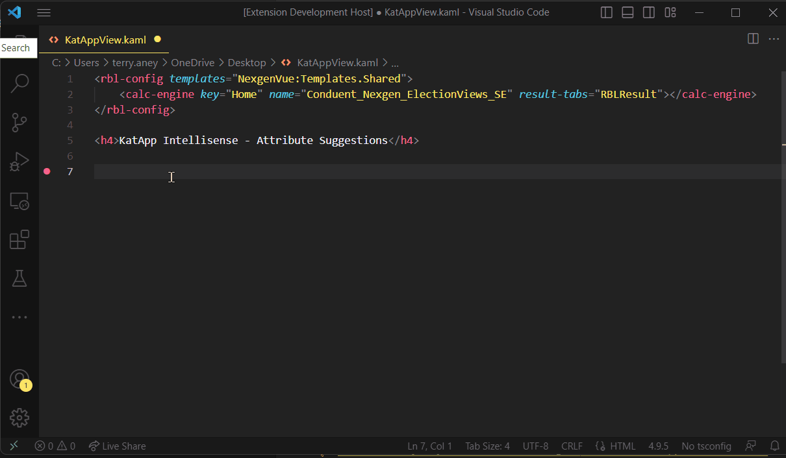
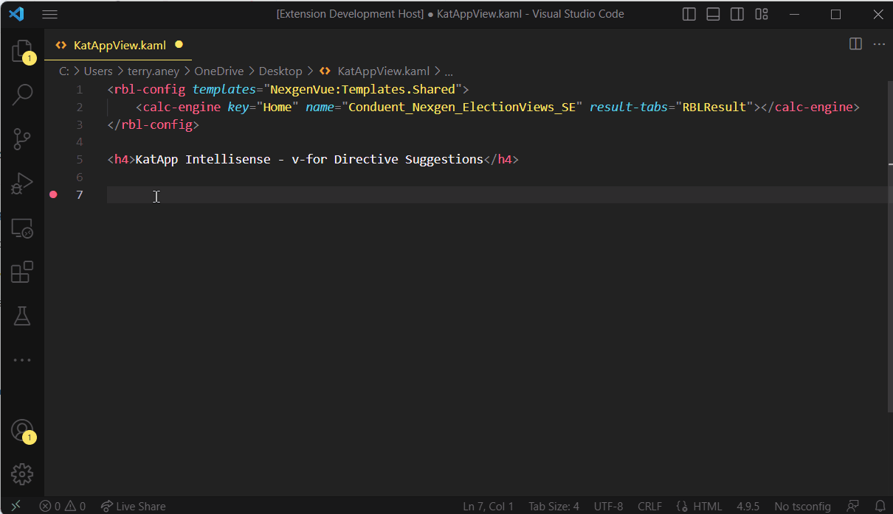
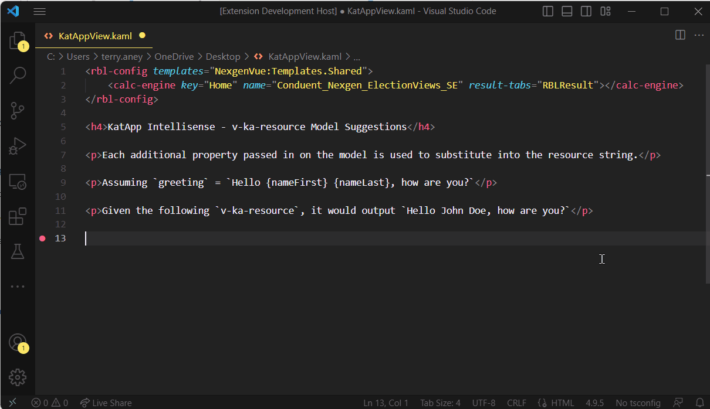
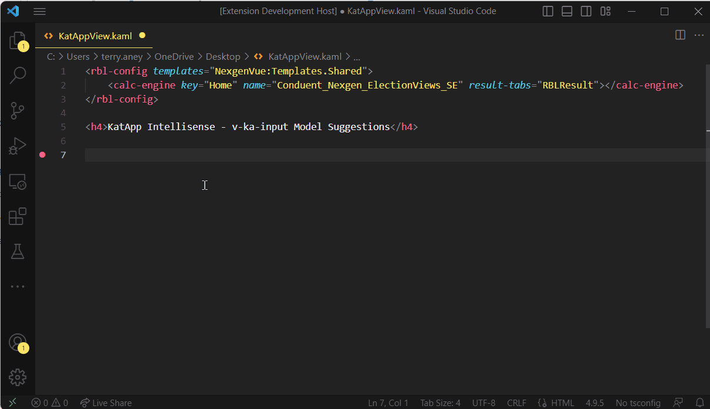
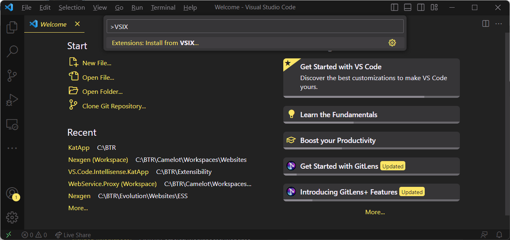

# VS Code Intellisense for KatApp Framework

A VS Code extension to provide intellisense and code completion suggestions for [KatApp Framework](https://github.com/terryaney/Documentation.Nexgen/blob/main/KatApp.md) features when editing `.kaml` files.  To get full syntax highlighting within the KatApp/Vue directives, the [Vue Language Features (Volar)](https://marketplace.visualstudio.com/items?itemName=Vue.volar) extension is suggested.

## Features

1. Hovering over known KatApp and Vue directives providing more context help and links to additionall documentation.

2. Code completion for `v-ka-*` and `v-*` attributes on HTML elements.

3. Code completion for properties of `v-ka-*` directive models (samples of a few of the many supported features below).

**v-for Directive Suggestions**

**v-ka-resource Model Suggestions**

**v-ka-input Model Suggestions**

## Getting Started

1. [Download the extension](https://github.com/terryaney/Extensibility.VS.Code.Intellisense.KatApp/raw/main/dist/vs-code-intellisense-katapp-1.0.5.vsix).
1. Install the extension by pressing `CTRL+SHIFT+P` to bring up VS Code command pallette.  Type `VSIX` and choose `Extensions: Install from VSIX...`.

3. Browse to the `VS.Code.Intellisense.KatApp.vsix` location and select it.
4. Open a `.kaml` file and enjoy.

## Known Issues

1. Code completion suggestions are enabled when inside 'property values' (i.e. name: '{typing in here will bring up suggestions}')
1. No completion suggestions are enabled when inside an 'array' of known objects (i.e. v-ka-input-group.helps).

## Future Ideas

1. Snippets for v-ka-* that inject div with attribute and default settings to start
1. Template Detection - When assigning a template, get a list of known templates and allow for choosing from known list.
1. Single vs Array of Objects - When inside properties that can be array (use ts.isArrayLiteralExpression(propertyInitializer)) or single 'known object', propmt the correct intellisense (i.e. v-ka-input-group.helps - should be able to prompt for help object properties correctly)
1. `v-ka-*` Model property hover - When hovering over a known property of the model, have intellisense popup.
1. Template Navigation - All for 'go to definition' on a template name.
1. Scope Intellisense - When working with a v-ka-* 'scope', able to make intellisense popup? 
    1. How to tell which scope 'type' is in use?
    1. How to detect when suggestions should be made (i.e. pop up on any 'expression item' (:attr=""))?
    1. When inside a v-for, able make scope work?

## Release Notes

**Enjoy!**

## Previous Versions

1. [1.0.4](https://github.com/terryaney/Extensibility.VS.Code.Intellisense.KatApp/raw/main/dist/vs-code-intellisense-katapp-1.0.4.vsix)
1. [1.0.3](https://github.com/terryaney/Extensibility.VS.Code.Intellisense.KatApp/raw/main/dist/vs-code-intellisense-katapp-1.0.3.vsix)
1. [1.0.2](https://github.com/terryaney/Extensibility.VS.Code.Intellisense.KatApp/raw/main/dist/vs-code-intellisense-katapp-1.0.2.vsix)
1. [1.0.1](https://github.com/terryaney/Extensibility.VS.Code.Intellisense.KatApp/raw/main/dist/vs-code-intellisense-katapp-1.0.1.vsix)